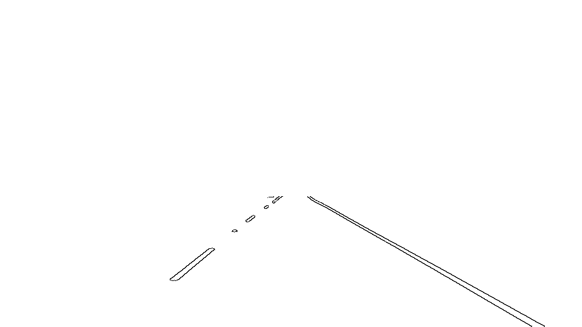
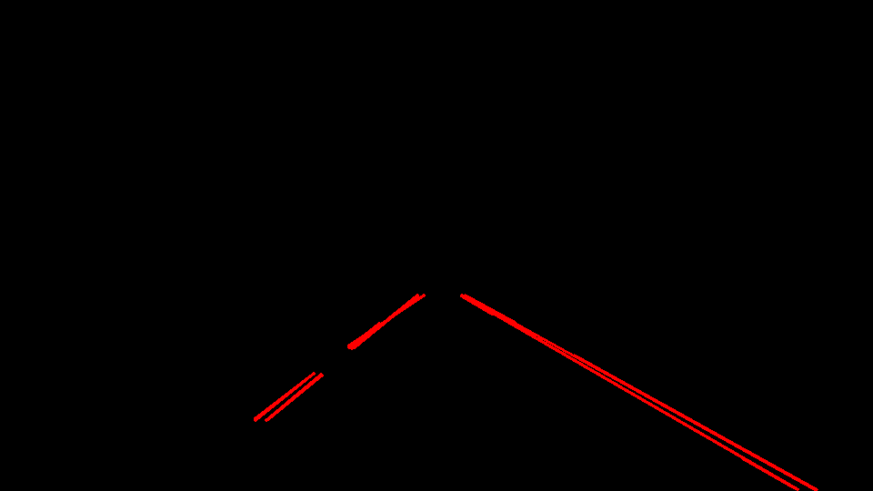
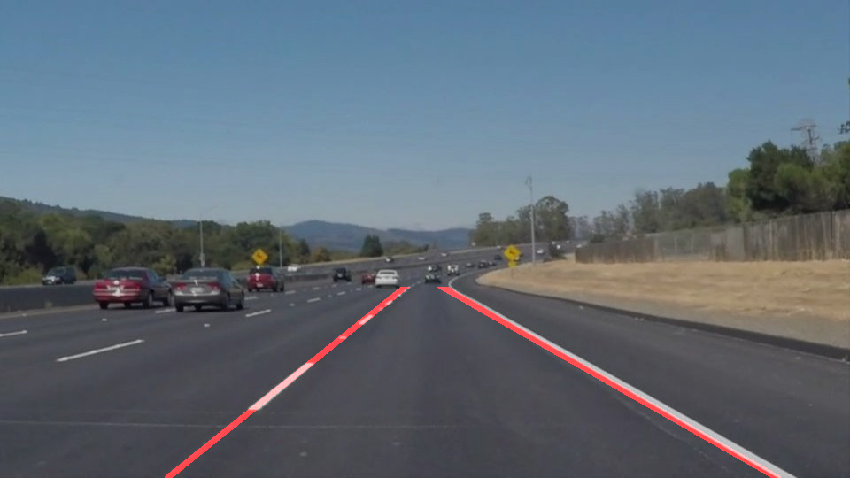

# **Finding Lane Lines on the Road**
<!--
## Writeup Template

### You can use this file as a template for your writeup if you want to submit it as a markdown file. But feel free to use some other method and submit a pdf if you prefer.

---

**Finding Lane Lines on the Road**

The goals / steps of this project are the following:
* Make a pipeline that finds lane lines on the road
* Reflect on your work in a written report

[//]: # (Image References)

[image1]: ./examples/grayscale.jpg "Grayscale"

---
 -->

### 1. Pipeline

My pipeline consist of 3 steps. The following figures show the output of the steps.

1. Detect edges inside the region of interest using Canny edge detector.
2. Detect lines from the edges using cv2.HoughlineP
3. Detect the lanes by

    3.1 Separate lines into groups of positive slop and negative slop for the left and right lanes

    3.2 Transform the lines in each group to polar representation (i.e. $r = xcos(\theta) + ysin(\theta)$)

    3.3 Output the median of all lines in the polar representation as the line representation of the lane.

### 2.Shortcomings and possible improvements

My lane detection assumes that the majority of lines in a group belongs to the lane. Therefore, if there are too much irrelevant lines in a group, the median of them will not represent the correct lane. In the "challenge.mp4" test video, my method failed because there are too much irrelevant edges.

Another The lanes detected from the test video are a bit shaky. This is mainly because outliers can still affect the median of the lines. Even without outliers, the median can switch between the left edge or right edge of the lane. A robust but more complex way to aggregate the detected lines would be RANSAC line fitting.
